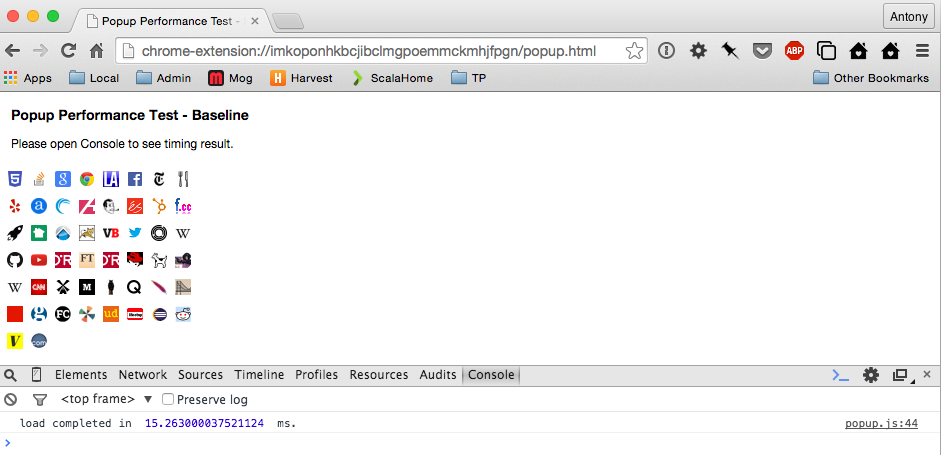
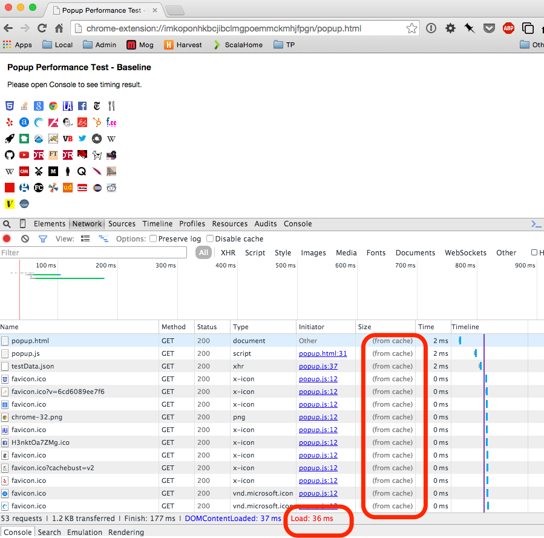
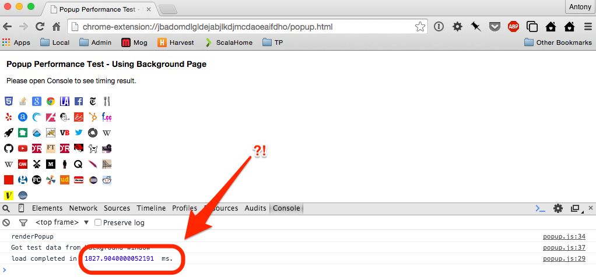
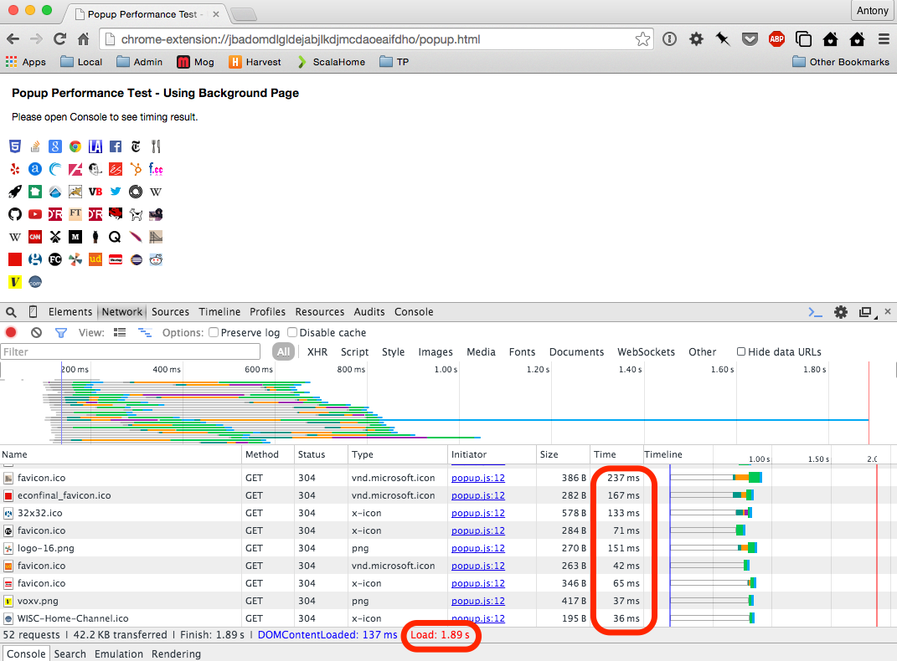

### Chrome Extension Popup Performance Test

This repository contains a minimal Chrome Extension that demonstrates a performance issue that seems to arise when a popup
window in a Chrome extension accesses a background window.

There are two subfolders here with almost identical versions of the Chrome Extension:

- **PopupPerfDirect** - This is the baseline version of the extension that does not use a background page. Performance is roughly what I would expect: A few ms to complete (assuming the relevant images have been cached).
- **PopupPerfBGPage** - This differs from the baseline version only by the popup obtaining the inital test data from a background window. Accessing the background window seems to have the unexpected side effect of disabling the HTTP cache when running the JavaScript for the popup (based on the Network timeline, see below). The measured time for the `onload` event to complete is orders of magnitude longer than the baseline.

### To Install and Reproduce The Issue

1. Clone or unzip this repository.  Load each sub-folder (`PopupPerfDirect` and `PopupPerfBGPage`) as an unpacked extension (in `chrome://extensions`).

2. Find the Extension's ID in its entry on `chrome://extensions` (a long string like `'lpnflkebdccfoepecaiieggjkbjejkdi'`).

3. Construct the URL to open each extension's `popup.html` page using the ID, and open this in a new tab. For example:  `'chrome-extension://lpnflkebdccfoepecaiieggjkbjejkdi/popup.html'`.

4. Open Developer Tools, select 'Console' to see the measured time for the `onload` event. Then select 'Network', and Reload the page.  

You should see something like this (I've highlighted essential results for comparison and what I found surprising):

**PopupPerfDirect**:

**PopupPerfBGPage**:

